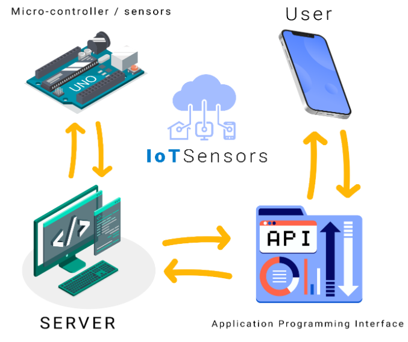

# IoT-NodeJS
This Project is about controlling Micro Controller Modules in a mobile application using accessible API from a server it's built using Node JS, React Native, Sockets and ESP8266 Micro-controller 

# How it Works?
</img>

First, the mobile application will access the API to send or get data from the server then when the server receive the request it will emit the command (get data, turn switch) into micro controller then the micro controller will send a response into the server

# Demo
<a href="https://youtu.be/nYZWLHO9j18">Video Demo</a>